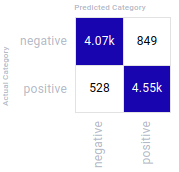
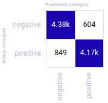
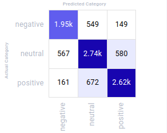

# Text Sentiment Analysis with Sequential Models, Additive Attention, and Transformers

**Sentiment Analysis** is a Natural Language Processing (NLP) technique used to classify the sentiment of text data as _positive_, _negative_, or _neutral_. It involves processing textual input and classifying sentiment using methods such as lexicon-based approaches, machine learning, or deep learning models. This technique has applications in areas like business, social media monitoring, finance, and healthcare, enabling insights into public sentiment, customer satisfaction, and market trends.

This repository implements and compares various deep learning models for sentiment analysis, including:
- Sequential models with additive attention mechanisms.
- Fine-tuning Transformer models for binary and multi-class sentiment classification.

## Binary Text Sentiment Analysis

> [!NOTE]
> `Custom Embeddings` using the train dataset vocabulary were used for this experiment.   

| Model            | Best Epoch | Train Loss | Test Loss | Train Acc | Test Acc |
|------------------|------------|------------|-----------|-----------|----------|
| LSTM + Attention | 13         | 0.2499     | 0.344    | 0.8986    | 0.8572  |   
| **BiLSTM + Attention* | **6**        | **0.286**     | **0.3349**    | **0.8795**    | **0.8624**   |
| GRU + Attention  | 12        | 0.2514     | 0.3289    | 0.8972    | 0.8522   |
| BiGRU + Attention  | 8         | 0.2433     | 0.3672    | 0.8998    | 0.8535   |

### Confusion Matrix

| LSTM + Attention | BiLSTM + Attention | GRU + Attention |BiGRU + Attention |
|------------------|------------|------------|-----------|
|  |  |   | |

## MultiClass Text Sentiment Analysis

> [!NOTE]
> `Small Spacy Embeddings` were used for this experiment. 

| Model            | Best Epoch | Train Loss | Test Loss | Train Acc | Test Acc |
|------------------|------------|------------|-----------|-----------|----------|
| LSTM + Attention | 23         | 0.5530     | 0.7040    | 0.7748    | 0.7124   |
| BiLSTM + Attention | 14       | 0.5572     | 0.6687    | 0.7680    | 0.7235   |
| GRU + Attention  | 21         | 0.5742     | 0.6618    | 0.7629    | 0.7250   |
| **BiGRU + Attention** | **22**        | **0.5099**     | **0.6593**    | **0.7893**    | **0.7335**   |

### Confusion Matrix

| LSTM + Attention | BiLSTM + Attention | GRU + Attention |BiGRU + Attention |
|------------------|------------|------------|-----------|
|  |  |   | |

> [!NOTE]
> All the experiments metrics are logged and each trained model and vocab files are uploaded under __Assets & Artifacts tab__ to Comet-ML.
> [__Link__](https://www.comet.com/luluw8071/tweet-sentiment-analysis/view/new/panels)

---
Feel free to send issues if you face any problem. 
Don't forget to star the repo :star: 